# Tokenization

### How do we prepare input text for training LLMs?
- Step 1: Splitting text into individual word and subword tokens
- Step 2: Convert tokens into token IDs
- Step 3: Encode token IDs into vector representations

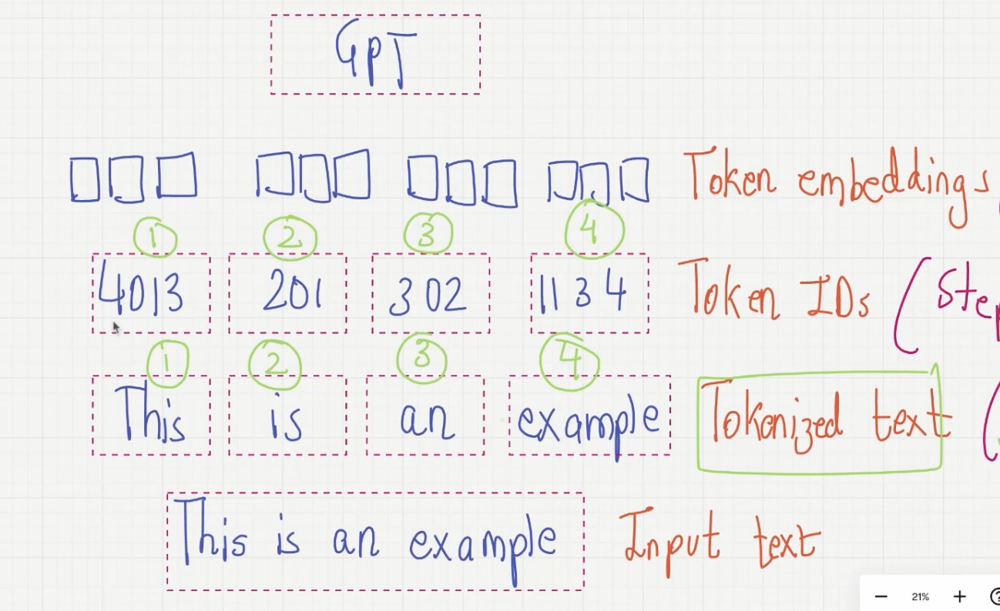

---

## Tokenizing Text

1. **Dataset used**:
   - ["The Verdict" by Edith Wharton](https://github.com/rasbt/LLMs-from-scratch/blob/main/ch02/01_main-chapter-code/the-verdict.txt)
2. **Download and load in Python**
3. **Tokenize the short story**:
   - Use Python's regular expression library
4. **Convert tokens into Token IDs**:
   - Build vocabulary - list of all tokens we have in alphabetical order
   - Each unique token is mapped to a unique integer called Token ID
5. **Implement the Tokenizer class**:
   - **Encode**  
     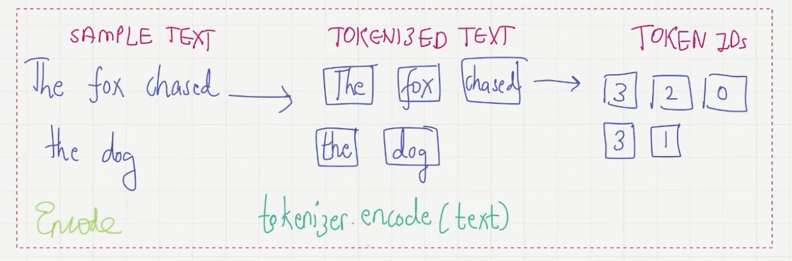
   - **Decode**  
     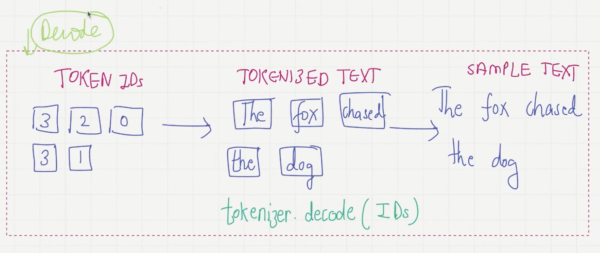

6. **Adding Special Context Token**:
   - Unknown `<|unk|>` and end-of-text `|<endoftext>|`

   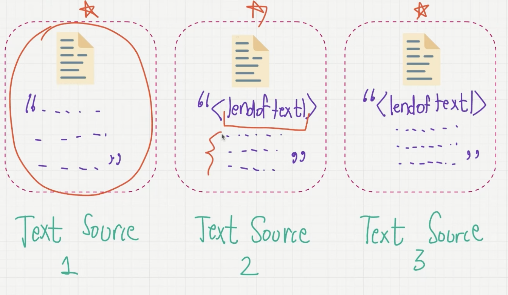
   - When working with multiple text sources, we add `|<endoftext>|` tokens between texts.
   - These `|<endoftext>|` tokens act as markers, signaling the start/end of a particular segment.
   - This leads to more effective processing and understanding by the LLM.

---

## Byte-based Tokenization

### 1. Tokenizing Types

- **Word-Based**:
  - Tokenize based on words:
    - `"my hobby is playing cricket"` → `['my', 'hobby', 'is', 'playing', 'cricket']`
  - **Cons**:
    - Out-of-Vocabulary (OOV) words
    - Different meanings of similar words - `[boy, boys]`

- **Character-Based**:
  - Tokenize based on characters:
    - `"my hobby is playing cricket"` → `['m', 'y', 'h', ...]`
  - **Pros**:
    - Solves the OOV problem: very small vocabulary -- every language has a fixed number of characters (English = 256).
  - **Cons**:
    - The meaning associated with words is completely lost.
    - The tokenized sequence is much longer than the initial raw text.

- **Sub-word Based**:
  - **Rule 1**: Do not split frequently used words into smaller subwords.
  - **Rule 2**: Split rare words into smaller, meaningful subwords.

    ```
    "boy" should not be split
    "boys" should be split into "boy" and "s"
    ```

  **Pros**:
  1. Subword splitting helps the model learn that different words with the same root word are related.
     - e.g., `"token"` like `"tokens"` and `"tokenizing"` are similar in meaning.
  2. It helps the model learn that `"tokenization"` and `"modernization"` are made up of different root words but have the same suffix `"ization"` and are used in similar syntactic situations.

---

### 2. Byte Pair Encoding (BPE)

**Byte Pair Encoding (BPE)** is a subword tokenization algorithm.

**Most common pair of consecutive bytes of data is replaced with a byte that does not occur in the data.**

Example:
-
Original data: `aaabdaaabac`

1. The byte pair `'aa'` occurs the most. Replace it with `'Z'` as `'Z'` does not occur in the data.
2. Compressed data: `ZabdZabac`
3. The next common byte pair is `'ab'`. We will replacee this by `'Y'`
4. Compressed data: `ZYdZYac`
5. `'ac'` is only byte pair left. Appears only once, so wee do not encode it

---

### 3. How is the BPE algorithm used in LLM?

BPE ensures that most common words in the vocabulary are representeed as a single token, while rare words are broken down into two or more subword tokens.

Practical Example
-
- Consider the below dataset of words
    
        { "old": 7, "older": 3, "finest": 9, "lowest": 4 }

- Preprocessing: We need to add end token `"</w>"` at the end of each word.

        { "old</w>": 7, "older</w>": 3, "finest</w>": 9, "lowest</w>": 4 }

- Split words into characters and count their frequency

    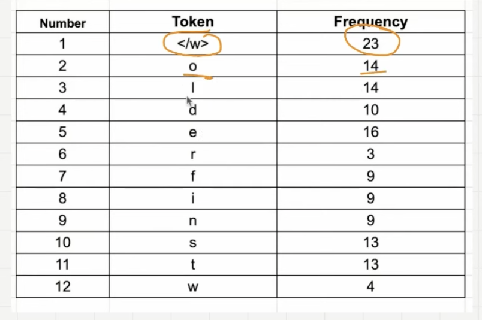

- Look for the most frequent pairing
    - merge them and perform the same iteration again and again until we reach the token limit or iteration limit

- Iterations

    1. Iteration 1: start with second most common token `"e"`. Most common byte pair starting with `"e"` is `"es"`

        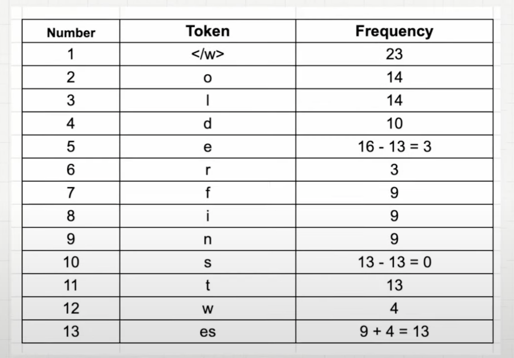

    2. Iteration 2: merge the tokens `"es"` and `"t"` as they have appeeared 13 times in our dataset

        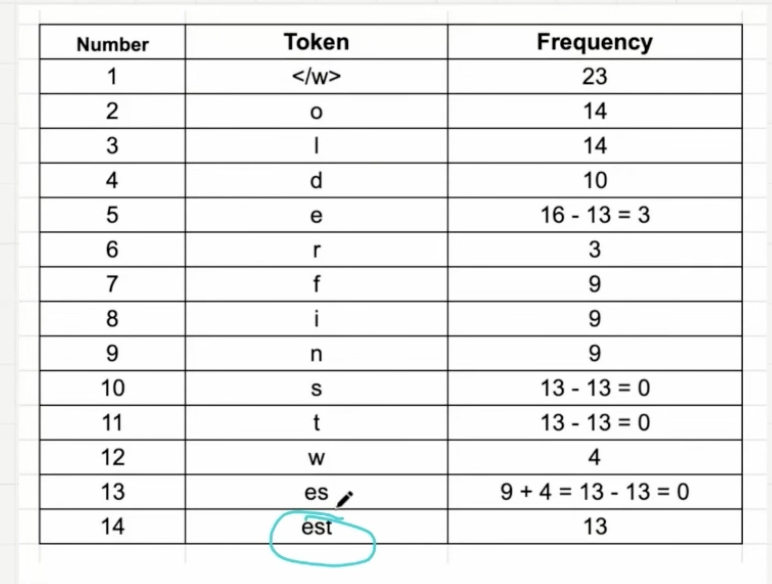

    3. Iteration 3: look at the `"</w>"` token. We see that `"est</w>"` appears 13 times

        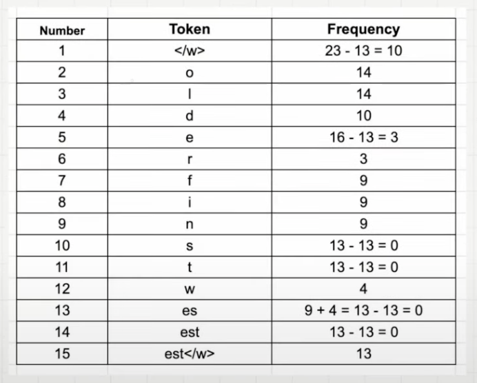

    - Reason we need to add `"est</w>"` even though we already have `"est"` is to help algorithm understand difference between `"estimate"` and `"highest"`
        - `"est</w>"`: ending seequence
        - `"est"`: other character can follow

    4. Iteration 4: `"o"` and `"l"` has appeared 10 times

        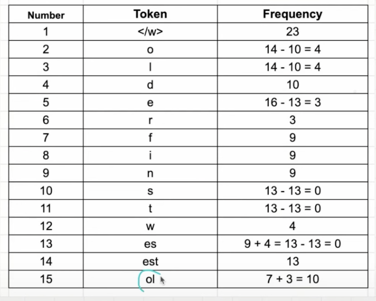

    5. Iteration 5: `"ol"` and `"d"` has appeared 10 times

        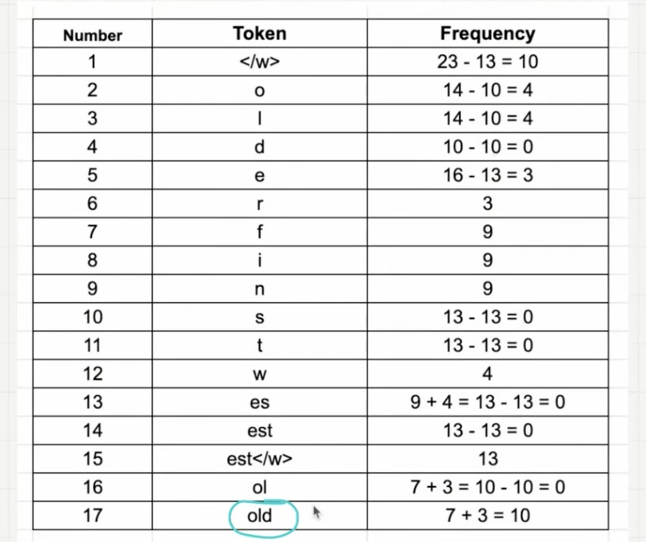

    6. Iteration 6: `"f"`, `"i"` and `"n"` appeared 9 times. But we just have one word wit these charcters `"finest"` - therefore, we are not merging them

- Remove token with zero count

    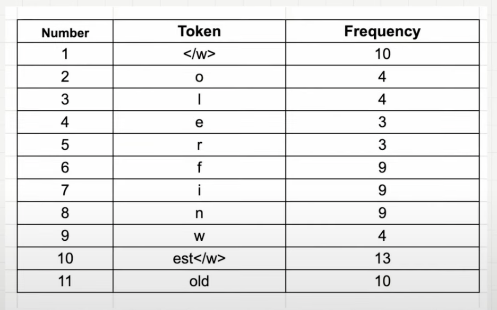

    - This list of 11 tokens will serve as our vocabulary

- **Stopping criteria can either be the token count or the numbere of iterations**

