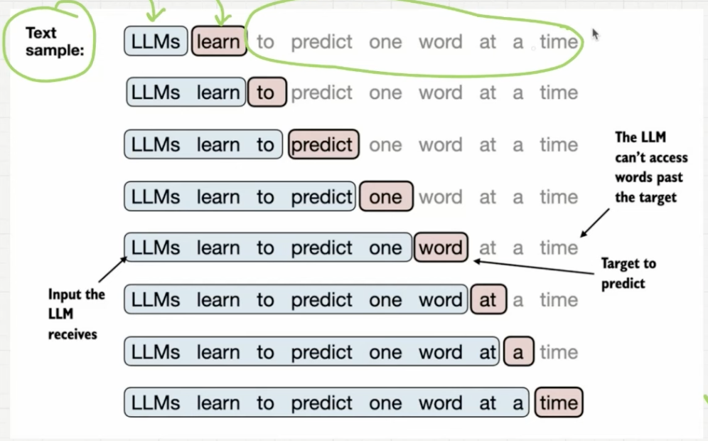
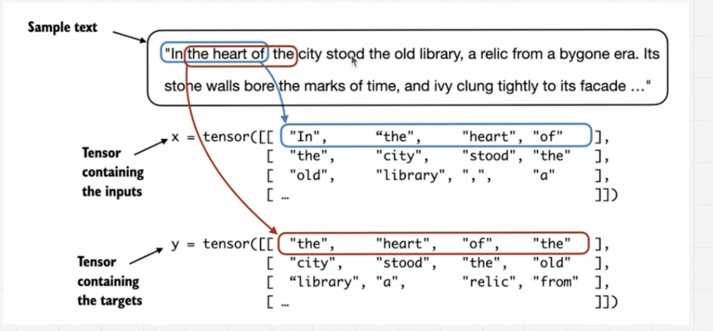
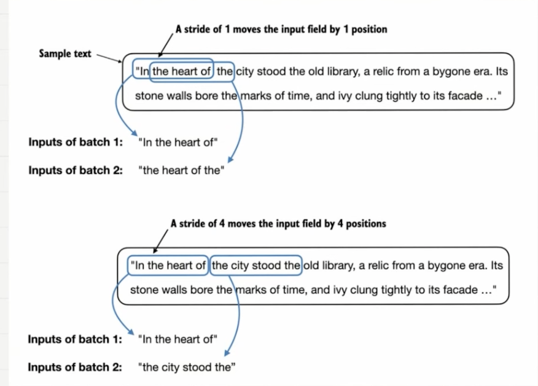

# Input-Target-Pairs

- Every stage of iteration, LLM has words until target word to be predicted as input
- Words after the target is masked
- Auto-Regression: output of previous iteration becomes part of input for next iteration

Given a text sample
--
- extract input blocks as subsamples that serve as input to the LLM
- LLMs prediction task during training is to predict the neext word that follows the iinput block
- during training, we mask out all words that are past the target

## Data Loader
Implement a data loader that fetches `input-output target pairs` using a `sliding window` approach.

### Data Loader Example

- To implement efficient data loaderes, we collect inputs in a `tensor x`, where each `row` represents one `input context`.
- The seecond `tensor y` contains the corresponding `prediction targets` (next words), which are created by `shifiting the input by one position`

### Stride

- more stride = move over the data faster.
- basically steps in for loop
- You can tweak stride to:
    - utilizee data set fully (not skipping over any words)
    - avoid any overlap between the batches; more overlap = increased overfitting

*usually set `stride to context length`*

### Batch Size
number of data that will be processed before updating parameters

- Small batch sizes require less memory during training but lead to noisy model updates
- Just like regular deep learning, the batch sizee is a trade-off and hyperparameter to experiment with when training LLMs

        small batch size = quick parameter updates = noisy model
        large batch size = long time to update parameters = less noisy model