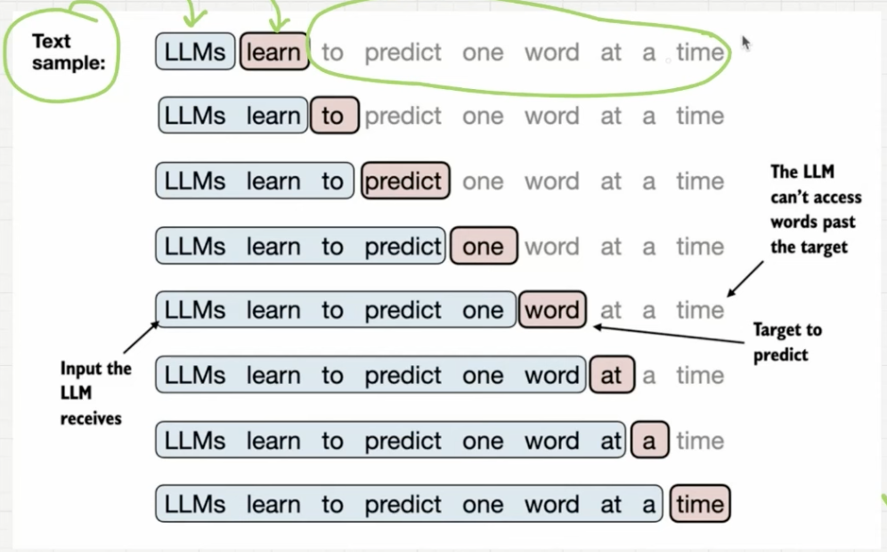

# Input-Target-Pairs

- Every stage of iteration, LLM has words until target word to be predicted as input
- Words after the target is masked
- Auto-Regression: output of previous iteration becomes part of input for next iteration

Given a text sample
--
- extract input blocks as subsamples that serve as input to the LLM
- LLMs prediction task during training is to predict the neext word that follows the iinput block
- during training, we mask out all words that are past the target

