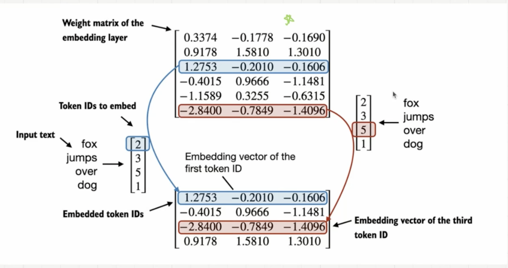

# Token Embedding

## Why token embeddings are needed?
--

### Representing Words Numberically
- Computers need numerical representation of words
- How can we represent words in numbers?
    - we cannot use random numbers because it does not capture semantic meanings (relationships)
- Words carry meaning and we neeed to capture this relation

### What about One-Hot Encoding?
- One-Hot Encoding
    1. Create a dictionary of words
    2. Assign seequential one-hot encoding to each word
- One-hot encoding also fails to capture semantic relationship

### Seemantically similar words should have similar vectors
- Encode every word as vector?
    - What would be the dimension?
    - Dimension should be determined by features. What feature?

    

- *Vectors can capture semantic meanings*

### How do you construct these vector?
- we can train a Neural Network to create Vector Embedding

    

- however, creating these vector embedding is not easy
    - computatiionally expensive due to huge amount of words
    - neeed to train neural networks to create correct vector embedding


2. Small hands on demo: playing with token eembeddings


3. How are tokeen embeeddings created for LLMs?
- Initialize embedding weights with random values
    - This initializatiion serves as the starting point for thee LLM leaerning process
- The embedding weights are optimized as part of the LLM training process
- vocabulary (usually sorterd alphabetically)
    - token ids aree converetede into embedding veectors
    - embedding layer weight matrix
- The embedding layer is a lookup operation that retrieves rows from the embedding layer weight matrix using a token ID



- What an embedding layeer actually does?
    -suppose we have the following 3 training examples:
    ```
    idx = torch.tensor([2,3,1])
    
    embedding dimension = 5
    embedding = torch.nn.Embedding(4,5)
    embedding.weight

    embedding(idx) # get vector for ID 2,3,1
    ```

    - This embedding is the same as neural network linear layer: `output = X * W^transpose`

    - ** Both embedding layer and NN linear layer lead to same output
        - Embedding layeer is much more computationally efficient, since NN linear layer has many unnecessary multiplication with zeero

